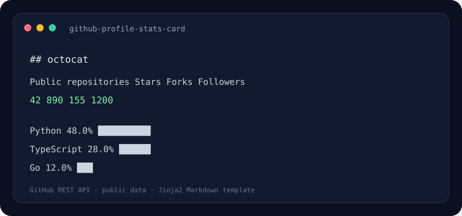

# GitHub Profile Stats Card Generator

A small developer tool that fetches public GitHub profile and repository data and renders a Markdown summary through a Jinja2 template.

> The image above is an illustrative rendering preview.

## Problem it solves

Profile statistics are easy to present inconsistently or let go stale. This tool creates a compact Markdown section with public repository totals, stars, forks, followers, and primary language distribution.

## Quick start

Requires Python 3.10 or later.

~~~powershell
python -m venv .venv
.venv\Scripts\Activate.ps1
python -m pip install -r requirements.txt
python -m github_profile_stats octocat --output ./profile-stats.md
~~~

The output is Markdown that can be reviewed and copied into a GitHub profile README. Set GITHUB_TOKEN in the environment for authenticated API access and higher rate limits. The token is never read from a project file or written to the generated output.

## How it works

1. Requests reads the public user profile and paginated repository list from the GitHub REST API.
2. Forks are excluded by default; use --include-forks to include them in project and language summaries.
3. Stars and forks are summed across selected repositories.
4. Language shares are calculated by the number of repositories whose primary language is that value.
5. Jinja2 renders a reusable Markdown file.

## Project layout

- **github_profile_stats/profile.py** — API client and aggregation.
- **github_profile_stats/templates/profile.md.j2** — editable Markdown template.
- **github_profile_stats/render.py** — template setup.
- **assets/preview.svg** — illustrative rendering preview.

## Tech stack

Python · GitHub REST API · requests · Jinja2

## Data scope and limits

The generator uses public profile and repository endpoints. Language share means share of repositories by primary language, not source-code byte counts. Private repository details and contribution totals are not included. API rate limits apply; use a personal access token only through the GITHUB_TOKEN environment variable and do not publish it.

## License

MIT.
